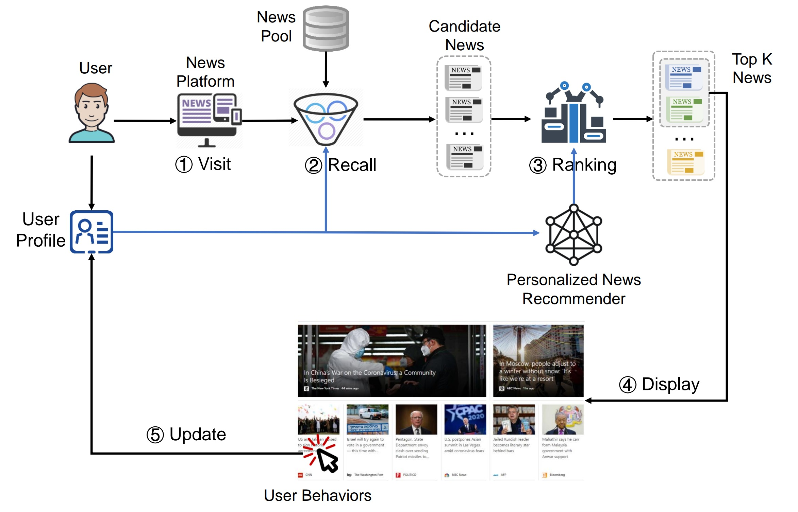
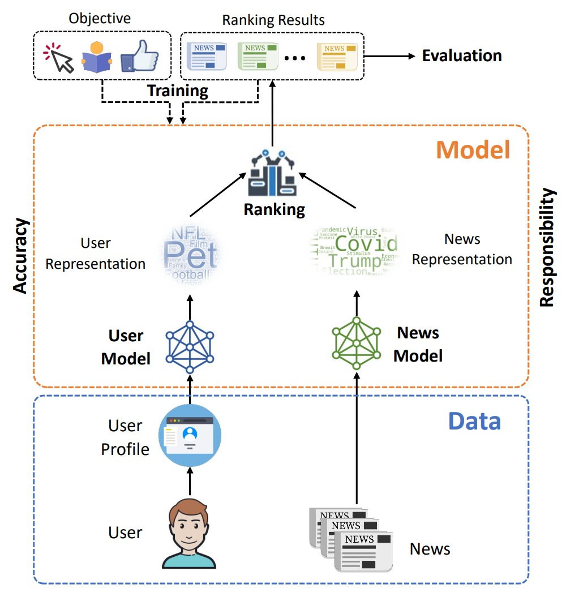

# News-Recommendation-with-Attention

This is the final assignment for course CSE258. The project works on the problem of news recommendation. In the first part, we conduct a concise introduction and survey on news recommendations, in which we define the problem and introduce the methods and techniques of some latest algorithms. In the second part, we implemented some selected algorithms with attention mechanisms to evaluate their performances. 

## Reference

[1] Dzmitry Bahdanau, Kyunghyun Cho, and Yoshua Bengio. Neural machine translation by jointly learning to align and translate. arXiv preprint arXiv:1409.0473, 2014.

[2] Ashish Vaswani, Noam Shazeer, Niki Parmar, Jakob Uszkoreit, Llion Jones, Aidan N Gomez, Łukasz Kaiser, and Illia Polosukhin. Attention is all you need. Advances in neural information processing systems, 30, 2017.

[3] Chuhan Wu, Fangzhao Wu, Suyu Ge, Tao Qi, Yongfeng Huang, and Xing Xie. Neural news recommendation with multi-head self-attention. In Proceedings of the 2019 conference on empirical methods in natural language processing and the 9th international joint conference on natural language processing (EMNLP-IJCNLP), pages 6389–6394, 2019.

4] Chuhan Wu, Fangzhao Wu, Yongfeng Huang, and Xing Xie. Personalized news recommendation: Methods and challenges. ACM Transactions on Information Systems (TOIS), 2022.
[5] Fangzhao Wu, Ying Qiao, Jiun-Hung Chen, Chuhan Wu, Tao Qi, Jianxun Lian, Danyang Liu, Xing Xie, Jianfeng Gao, Winnie Wu, et al. Mind: A large-scale dataset for news recommendation. In Proceedings of the 58th Annual Meeting of the Association for Computational Linguistics, pages 3597–3606, 2020.
